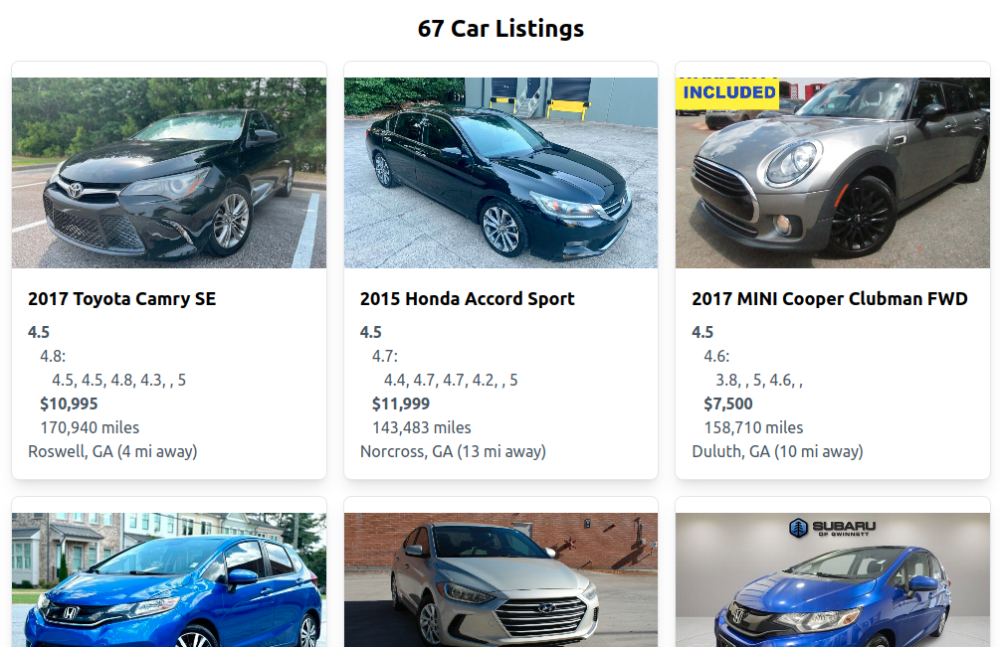
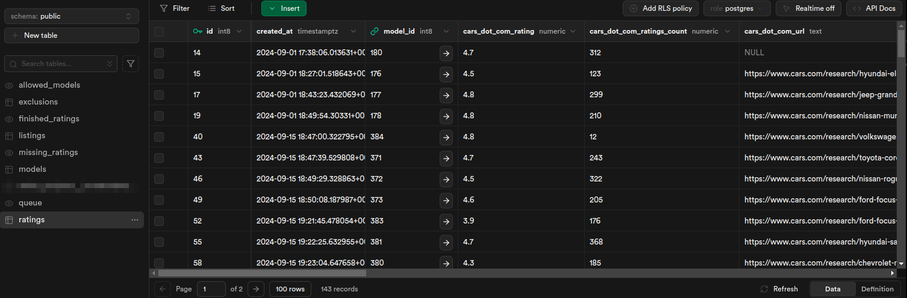

# Goal

To buy a car that fits my needs.

## App goal

To show an updated list of nearby used car listings filtered by my requirements and sorted descending by a weighted score.

(The score algorithm considers various factors such as 3rd-party ratings, price, odometer, etc.)

# Keep in mind

How I work on a 1-person project in a personal repo differs from how I work on a team.

E.g. the commit messages and comments I write, the trade-offs I make (security, testing, etc) and shortcuts I take (such as not using database migrations), the barebones UX, etc.

Probably nobody but me will ever even look at this repo, but as my own "customer" I want to organize and document everything well enough that I could quickly resume this project even if I abandon it for a long time.

# Screenshots

## Barebones UX (enough to serve my purposes)



## Supabase database

4 [tables](sql/tables) (models, listings, ratings, exclusions) plus some [views](sql/views):



1. "models" stores information like year, make, model, and trim.
1. "listings" then has a foreign key relationship to "models" and also includes information like price, odometer, color, etc.
1. "ratings" also has a foreign key relationship to "models" and is where the 3rd-party ratings information lives.
1. "exclusions" allows me to block-list trucks, minivans, etc.

# Architecture / Design

It's a TypeScript [Next.js](https://nextjs.org/) app using [Tailwind](https://tailwindcss.com/) styles.

[Envalid](https://github.com/af/envalid) ensures that the environment variables are set properly.

The data lives in a [Supabase](https://supabase.com/docs/reference/javascript) PostgreSQL database.

Scraping uses [puppeteer-extra-plugin-stealth](https://www.npmjs.com/package/puppeteer-extra-plugin-stealth).

[Day.js](https://day.js.org/) helps with datetime manipulation.

I built a mobile app using [Retool](https://retool.com/) but abandoned it as superfluous.

The main cron jobs are:

- [helpers/cron_jobs/addNewListings.ts](helpers/cron_jobs/addNewListings.ts) (looks at CarGurus to get local listings that are not in this database yet)
- [helpers/cron_jobs/scrapeAllMissingRatings.ts](helpers/cron_jobs/scrapeAllMissingRatings.ts) One by one, visits various 3rd-party websites to get ratings for each car model
- [helpers/cron_jobs/checkWhetherStillAvailableLooper.ts](helpers/cron_jobs/checkWhetherStillAvailableLooper.ts) Revisits each listing on CarGurus to see if the car is still available and whether it has an updated price or image.

# Linting

I'm a huge fan of guardrails like linting.

Over the years, I've experimented with a bunch of approaches.

My current favorite is based on https://github.com/gajus/canonical and then tweaked slightly to my preferences.

Restrictive linting + git hooks can help a team more than I would have expected (and helps with onboarding new teammates, especially less experienced ones).

It can be like a cheat-code for better engineering.

# Running the local dev server

```
yarn install
yarn dev
```

# TODO

1. make the frontend interactive
   - allow adding new exclusions
   - allow discarding a listing (setting to inactive)
1. add Autotrader ratings?

# Notes about avoiding captchas and bot-blockers

I think as long as I:

- run it on my local computer (on a residential IP instead of in a cloud like AWS)
- don't use "headless" mode but instead have it open an actual browser window
- tell it to rely on the "userDataDir" of my real browser where I've already passed the captcha
- use https://www.npmjs.com/package/puppeteer-extra-plugin-stealth
- run the browser via a TypeScript script directly instead of within a Next.js API endpoint

it seems to work. 🤞

It linked to https://bot.sannysoft.com/ which is a cool page.

P.S. Free up to 1k URLs: https://www.zenrows.com/?fpr=signup

# Links (protected)

- https://supabase.com/dashboard/project/yzvxivcshrizfccwujzp/editor/29539?schema=public
- https://docs.google.com/spreadsheets/d/1zbVM49t9cVFi_YPUVExwWkUPISUiC1psUyI4EcHq2SU/edit?gid=2037153460#gid=2037153460

# Direct connection to Supabase Postgresql DB (such as via DBeaver)

URL:

jdbc:postgresql://aws-0-us-east-1.pooler.supabase.com:6543/postgres

username: postgres.yzvxivcshrizfccwujzp

(The second part comes from the subdomain of SUPABASE_URL environment variable.)

password: {in Bitwarden}

https://supabase.com/dashboard/project/yzvxivcshrizfccwujzp/settings/database

# Deployment

Is automatic to https://cars-walsh.vercel.app/ upon push of `main` branch to GitHub.
